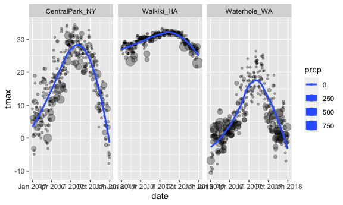
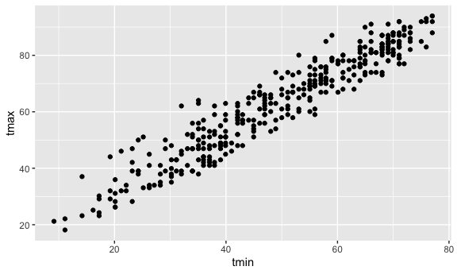
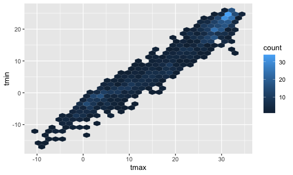
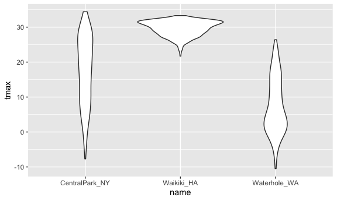
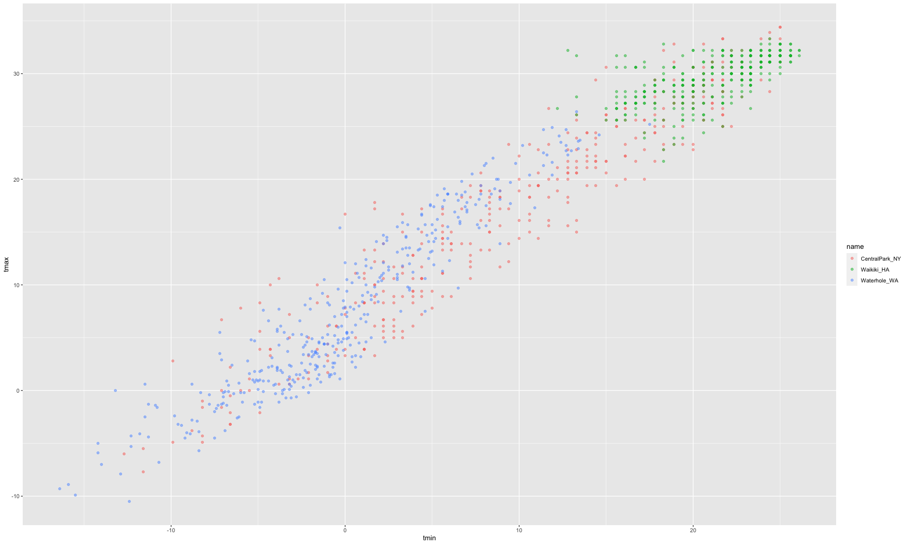

ggplot 1
================

load in a dataset

``` r
weather_df = 
  rnoaa::meteo_pull_monitors(  # download the dataset 
    c("USW00094728", "USC00519397", "USS0023B17S"),
    var = c("PRCP", "TMIN", "TMAX"), # pick three variabels that you care about
    date_min = "2017-01-01",
    date_max = "2017-12-31") %>%  # from 20170101 to 20171231
  mutate(
    name = recode(  # create a new name variable that recode the weather station
      id, 
      USW00094728 = "CentralPark_NY", 
      USC00519397 = "Waikiki_HA",
      USS0023B17S = "Waterhole_WA"),
    tmin = tmin / 10,
    tmax = tmax / 10) %>%
  select(name, id, everything())
```

    ## Registered S3 method overwritten by 'hoardr':
    ##   method           from
    ##   print.cache_info httr

    ## using cached file: ~/Library/Caches/R/noaa_ghcnd/USW00094728.dly

    ## date created (size, mb): 2021-10-05 10:29:22 (7.602)

    ## file min/max dates: 1869-01-01 / 2021-10-31

    ## using cached file: ~/Library/Caches/R/noaa_ghcnd/USC00519397.dly

    ## date created (size, mb): 2021-10-05 10:29:25 (1.697)

    ## file min/max dates: 1965-01-01 / 2020-02-29

    ## using cached file: ~/Library/Caches/R/noaa_ghcnd/USS0023B17S.dly

    ## date created (size, mb): 2021-10-05 10:29:27 (0.912)

    ## file min/max dates: 1999-09-01 / 2021-09-30

``` r
weather_df
```

    ## # A tibble: 1,095 × 6
    ##    name           id          date        prcp  tmax  tmin
    ##    <chr>          <chr>       <date>     <dbl> <dbl> <dbl>
    ##  1 CentralPark_NY USW00094728 2017-01-01     0   8.9   4.4
    ##  2 CentralPark_NY USW00094728 2017-01-02    53   5     2.8
    ##  3 CentralPark_NY USW00094728 2017-01-03   147   6.1   3.9
    ##  4 CentralPark_NY USW00094728 2017-01-04     0  11.1   1.1
    ##  5 CentralPark_NY USW00094728 2017-01-05     0   1.1  -2.7
    ##  6 CentralPark_NY USW00094728 2017-01-06    13   0.6  -3.8
    ##  7 CentralPark_NY USW00094728 2017-01-07    81  -3.2  -6.6
    ##  8 CentralPark_NY USW00094728 2017-01-08     0  -3.8  -8.8
    ##  9 CentralPark_NY USW00094728 2017-01-09     0  -4.9  -9.9
    ## 10 CentralPark_NY USW00094728 2017-01-10     0   7.8  -6  
    ## # … with 1,085 more rows

Start making some plots # Scatterplot tmax vs. tmin in a scatterplot

``` r
weather_df %>% 
  ggplot(aes(x = tmin, y = tmax)) + 
  geom_point()
```

    ## Warning: Removed 15 rows containing missing values (geom_point).


you can save ggplots

``` r
gg_tmax_tmin = 
  weather_df %>% 
  ggplot(aes(x = tmin, y = tmax)) +
  geom_point()

gg_tmax_tmin # you can add geometry to this object
```

    ## Warning: Removed 15 rows containing missing values (geom_point).


## Add more details/ fancy it up

add color? lines? other stuff?

``` r
weather_df %>% 
  ggplot(aes(x = tmin, y = tmax, color = name)) + # straightforward explanation
  geom_point( alpha = 0.3) +  # alpha = 0: transparent, = 1: opaque, but the line is left along. you can set the geometry specific aesthetic by adding the aes() here or in ggplot() function (this will be global)
  geom_smooth(se = FALSE) + # add three different lines showing the middle of the data set (nonlinear), Display confidence interval around smooth? 
  facet_grid(. ~ name) # spread things out, the dot: don't want to separate the rows, just give me three separate columns
```

    ## `geom_smooth()` using method = 'loess' and formula 'y ~ x'

    ## Warning: Removed 15 rows containing non-finite values (stat_smooth).

    ## Warning: Removed 15 rows containing missing values (geom_point).


Let’s make more ggplot

``` r
weather_df %>% 
  ggplot(aes(x = date, y = tmax, size = prcp)) + # size of the scatterplot is proportional to the precipitation
  geom_point(alpha = .3) + 
  facet_grid(. ~name) + 
  geom_smooth(se = FALSE)  # hard to see the CI
```

    ## `geom_smooth()` using method = 'loess' and formula 'y ~ x'

    ## Warning: Removed 3 rows containing non-finite values (stat_smooth).

    ## Warning: Removed 3 rows containing missing values (geom_point).



## Use data manipulation as part of this

``` r
weather_df %>% 
  # you can do this specifically to just one plot (i.e. central park)
  filter(name == "CentralPark_NY") %>% 
  mutate(
    tmax = tmax * (9/5)  + 32,
    tmin = tmin * (9/5)  + 32 
  ) %>% 
  ggplot(aes(x = tmin, y = tmax)) + 
  geom_point()
```



## stacking geoms

Which geoms do you want?

``` r
weather_df %>% 
  ggplot(aes(x = date, y = tmax, color = name)) + 
  geom_smooth(se = FALSE)  # can just show the smoothed line, if you want to show the points, you need to tell ggplot
```

    ## `geom_smooth()` using method = 'loess' and formula 'y ~ x'

    ## Warning: Removed 3 rows containing non-finite values (stat_smooth).


Hexbin

``` r
# hex meatmap
weather_df %>% 
  ggplot(aes(x = tmax, y = tmin)) + 
  geom_hex()  # geom_bin_2d() also works, but its component is bin
```

    ## Warning: Removed 15 rows containing non-finite values (stat_binhex).



## Univariate plots

``` r
weather_df %>% 
  ggplot(aes(x = tmax, fill = name)) +  # use +!!!!!
  geom_histogram() + 
  facet_grid(.~name)
```

    ## `stat_bin()` using `bins = 30`. Pick better value with `binwidth`.

    ## Warning: Removed 3 rows containing non-finite values (stat_bin).


# let’s try some other plots

``` r
weather_df %>% 
  ggplot(aes(x = tmax, fill = name)) +
  geom_density(alpha = 0.3)
```

    ## Warning: Removed 3 rows containing non-finite values (stat_density).


Still with tmax and main

``` r
weather_df %>% 
  ggplot(aes(x = name, y = tmax)) +
  geom_boxplot()
```

    ## Warning: Removed 3 rows containing non-finite values (stat_boxplot).


Some people like violin plot…

``` r
weather_df %>% 
  ggplot(aes(x = name, y = tmax)) +
  geom_violin() # you can see the full distribution with this
```

    ## Warning: Removed 3 rows containing non-finite values (stat_ydensity).



What about ridges?

``` r
weather_df %>% 
  ggplot(aes(x = tmax, y = name)) +
  geom_density_ridges(alpha = 0.8, scale = 0.8) # vertical separation of the plots, instead of on top of each other, scale: change separation between lines
```

    ## Picking joint bandwidth of 1.84

    ## Warning: Removed 3 rows containing non-finite values (stat_density_ridges).


## Embedding plots

``` r
# chunk header can change the output
weather_df %>% 
  ggplot(aes(x = tmin, y = tmax, color = name)) +
  geom_point(aes(color = name), alpha = .5) 
```

    ## Warning: Removed 15 rows containing missing values (geom_point).


